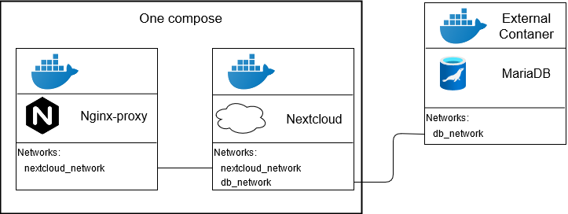

# Docker NextCloud
Для контейнера Nextcloud нам понадобится и база данных MariaDB, которую [ранее создали](../1.MariaDB/README.md).
Используется nextcloud-fpm версия с пробросом через контейнером nginx и cgi-модуля. 

  

Будет создана 2 конейтенера:
1. Само приложение NextCloud, на php-fpm с открытым портом 9000
2. Nginx-прокси, который будет обрабатывать все php запросы на первый контейнер

Причём важно заметить, так как нам не нужно открывать внешний порт для php-fpm, но чтобы он был виден для nginx-прокси, необходимо указать им одну сеть (networks). А nextcloud контейнеру  необходимо указать две сети: nextcloud-network и db_network (сеть где находится MariaDB), таким образом мы даём доступ к БД и прокси доступен доступ к 9000 порту Nextcloud контейнера.

### Детали

Так как я хочу чтобы по итогу nextcloud был доступен с домена по пути **mysite.ru/disk**, то указываю в пемереных конейтенера *OVERWRITEWEBROOT=disk*. Этот параметр указывает имя подпапки для пути статичных файлов (css, js и пр.).
Желательно так же указать *NEXTCLOUD_TRUSTED_DOMAINS=mysite.ru* чтобы обозначать наш домен как безопасным.
